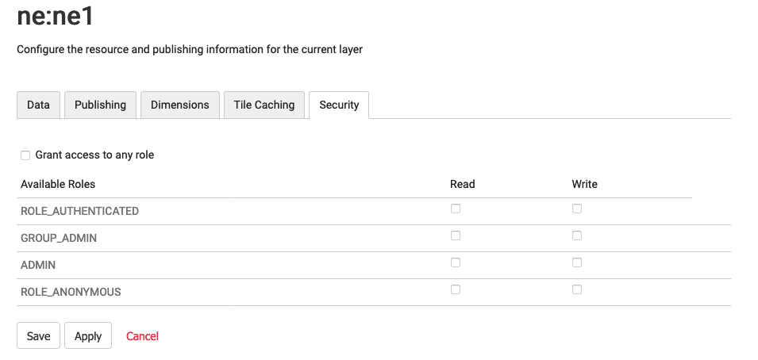
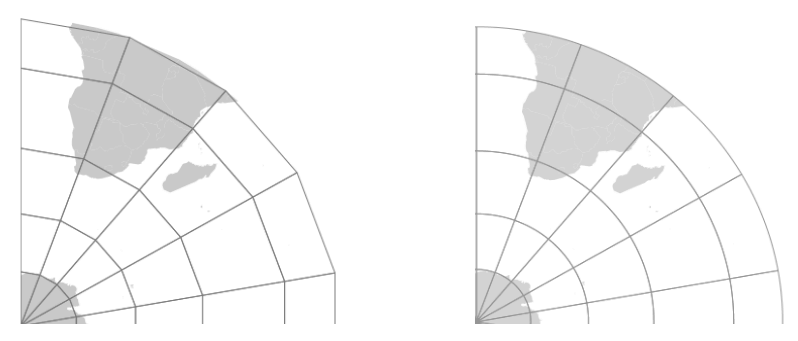
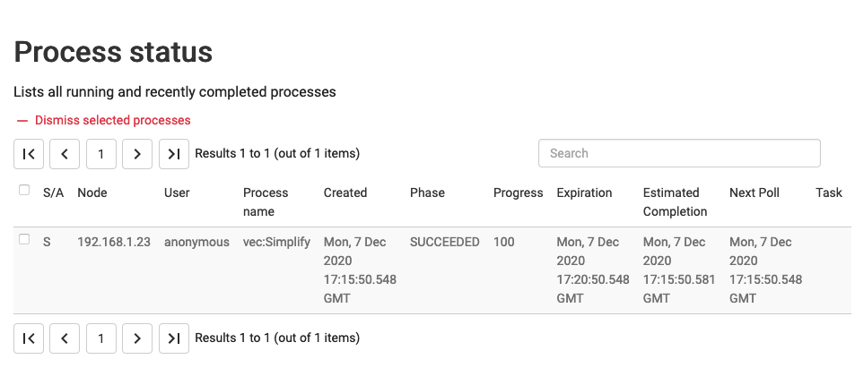
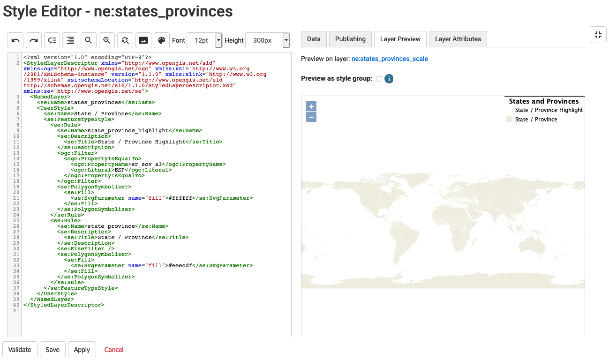
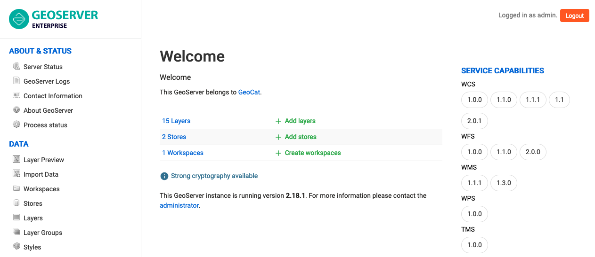
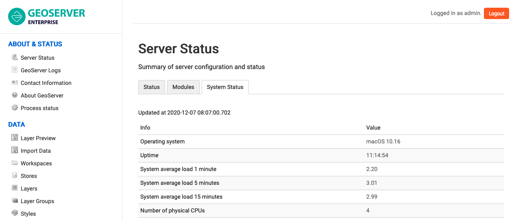
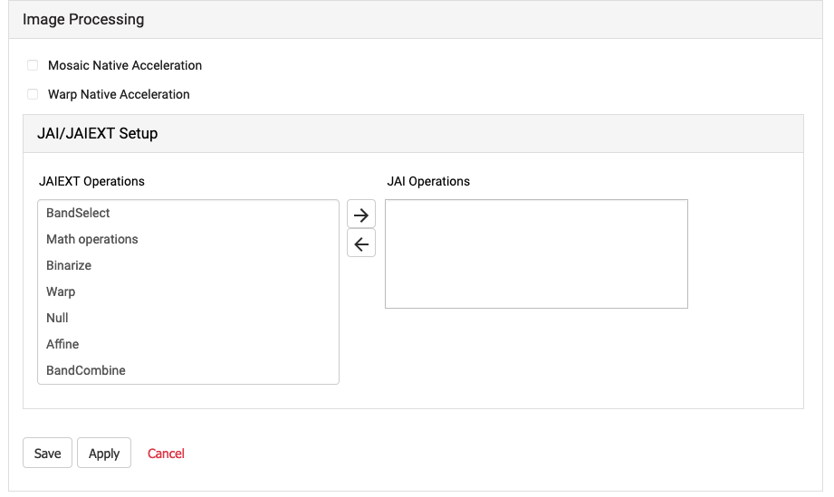

Features
========

:command:`GeoServer` is a high-performance web service for the publication of spatial information.  

:command:`GeoServer Enterprise` is a commercial distribution of :command:`GeoServer` offering  long-term-support and extended support options for GeoCat customers. GeoCat is a proudly open source company working as a member of the GeoServer community.

.. See internal document: https://docs.google.com/document/d/1FHiYkE4WEUtUY5y8iFGhbwzY2dTdh33pH8sQWqsUt1I/edit?usp=sharing

If you have used earlier versions of :command:`GeoServer Enterprise` review the `current release notes </welcome/index>` for an overview of significant changes in this version.

Web Services
------------

:command:`GeoServer Enterprise` publishes your information using a selection of open standards and industry standards.

GeoServer Enterprise:

* :ref:`wms`
  
  Shares information visually as cartographic data products generated from geospatial data and styling.
  
* :ref:`wfs`

  Publish vector information as geographic features for use in Desktop GIS, Web Mapping and Processing and Analysis.
  
* :ref:`wcs`

  Access raster information as a geographic coverage, generating and data products for analysis, processing and visualization.

* :ref:`WMTS / TMS / WMS-C <gwc>`
  
  Integrated GeoWebCache supports a range of tileset based protocols for mobile and web mapping applications.

GeoServer extensions:

* :ref:`wps` 

  Publishing of geospatial processes, algorithms, and calculations

* :ref:`csw`
  
  Retrieving records describing data products published by GeoServer.

Layer Service Settings
''''''''''''''''''''''

Often requested functionality, define which services are enabled on a layer-by layer basis directly from the layer editor. Previously this functionality was only available from the data security page.

See Layer :ref:`Service Settings <data_webadmin_layers>`.

EPSG database v 9.6
'''''''''''''''''''

The EPSG database has been updated to version 9.6, including roughly a thousand more codes than the previous version available in GeoServer. The code has also been updated to ensure the NTv2 grid shift files between GDA94 and GDA2020 work properly. Sponsored by GeoScience Australia.

Web Map Service
---------------

WMS Nearest Match for time dimension
''''''''''''''''''''''''''''''''''''

WMS time dimension can be configured for *nearest match*. This setting renders the nearest time to the one requested (either explicitly, or implicitly via the default time value).

* In case of mismatch the actual time used will be returned along with the response as a HTTP header.

* Functionality can be configured with a maximum tolerance, beyond that the server will throw a service exception.

Dynamic densification on reprojection
'''''''''''''''''''''''''''''''''''''

GeoServer has always reprojected data “point by point”, this typically caused long lines represented by just two points to be turn into straight lines, instead of curves, as they were supposed to.

There is a new “advanced projection handling” option in WMS enabling on the fly densification of data, the rendering engine computes how much deformation the projection applies in the area being rendered, and densifies the long lines before reprojection, resulting in eye pleasing curves in output. See a “before and after” comparison.

   
   Reprojection, original point by point versus densified mode

Web Feature Service
-------------------

Complex GeoJSON output changes
''''''''''''''''''''''''''''''

Improved GeoServer WFS generation of GeoJSON out of complex features data sources:

* The property/element alternation typical of GML is preserved, causing deeply nested data structures.
  
  To avoid writing `container.x.x` access to reach the `x` value, the output now skips one of the containers and exposes a direct `container.x` structure.
  
* XML attributes are now turned into plain JSON properties, and prefixed with a `@`
* Feature and data types are now preserved in translations, as a `@feaureType` and `@dataType` attributes
* Full nested features are encoded as GeoJSON again, keeping their identifiers

This work supports the use of app-schema compldex feature output.  Sponsored by French geological survey – BRGM, and the French environmental information systems research center – INSIDE.

Web Map Tile Service
--------------------

Tile protocols are provided by an emended GeoWebCache component.

Azure GeoWebCache blobstore
'''''''''''''''''''''''''''

Tiles can now be stored in Azure blob containers, increasing GeoWebCache compatibility with cloud environments.

Note Azure does not provide, a mass blob delete API. On truncate GeoWebCache is required to individually remove tiles making a DELETE request for each one.

Web Processing Service
----------------------

WPS Execution Management
''''''''''''''''''''''''

WPS `GetExecutions` vendor operation to list the running processes:

* Users can review all their running processes

* Administrators can see all processes

WPS `Dismiss` vendor operation to cancel the execution of one of the listed processes.

See :ref:`WPS Operations <wps_operations>`.

     
   Process status

Cartography
-----------

GeoServer Enterprise:

* Style Layer Descriptor (SLD)
* Symbology Encoding (SE)

GeoServer extension:

* Chart symbolizer
* MapBox Styling
* YSLD styling

GeoServer extensions (premium)
 
* CSS Styling
* Cross layer filtering
* SLD REST API service
  
  Service offering dynamic data driven generation of SLD styles.

Fullscreen style editor
'''''''''''''''''''''''

* The GeoServer style editor now includes a fullscreen side-by-side editing mode to easily preview appearance while editing a style.

  To toggle fullscreen mode click the fullscreen button at the top-right of the style editor.

   
   Full screen style editor

Style Editor helpers
''''''''''''''''''''

Style editor usability improved with:

* Toolbar color picker to select a color and turn it into HEX specification
  
  .. figure:: img/style_helpers.png
     
     Style helper color picker

* Toolbar file chooser to select an icon and build ExternalGraphic reference.
  
  .. figure:: img/style_helper_external_graphic.png
     :figwidth: 40%
     
     Style helper external graphic

* Auto-complete suggestions for SLD 1.0.

  Use :kbd:`control-space` for context aware suggestions.

RasterSymbolizer dynamic channel selection
''''''''''''''''''''''''''''''''''''''''''

A GeoServer extension to SLD supporting the use of expressions for SourceChannelName. This allows the dynamic channel selection, important for working with multispectral or hyperspectral data.

This approach avoids generating different styles for each false color combination.

Map algebra
'''''''''''

The rendering engine now provides support for an efficient map algebra package knows as Jiffle.

Jiffle was produced by Michael Bedwards, and has now been upgraded to support Java 8, and integrated in jai-ext. Now available GeoTools `gt-process-raster` module the functionality can be used from either WPS or as a rendering transformation.

See :ref:`rendering_transform`.

SLD Service
'''''''''''

The optional :ref:`SLD Service <extensions_sldservice>` extension is available for:

* The generation of classified maps of vector data based on criteria such as equal interval, quantiles and unique values.
* Vector data filtering based on standard deviation, equal area classification
* Raster processing with the generation of classified maps and data filtering.
* Raster processing makes use of automatic sub-sampling when the source image is too large.

The SLD REST Service is used to generate thematic styles based on attribute data:

.. code-block:: bash

    curl -v -u admin:geoserver -XGET
      http://localhost:8080/geoserver/rest/sldservice/states/classify.xml
      ?attribute=PERSONS
      &ramp=CUSTOM
      &method=quantile
      &intervals=3
      &startColor=0xFF0000
      &endColor=0x0000FF
      &open=true

See :ref:`SLD REST Service <extensions_sldservice>`.

Configuration
-------------

GeoServer enterprise:

* Web Administration
* GeoCat visual theme
* REST Configuration
* Web-resource tool page

GeoServer extension:

* Importer / REST API

GeoServer customization:

* Custom visual theme

GeoServer Enterprise Theme
''''''''''''''''''''''''''

GeoServer Enterprise includes a visual refresh with a fresh clean appearance.

 
   GeoServer Enterprise Theme

Status Monitoring
'''''''''''''''''

The :user:`Status Monitoring  <configuration/status.html#system-status>` tab is now included in the GeoServer :guilabel:`Status` page. This provides system statistics so monitor resource use from the Web UI.

 System status

Security
--------

GeoServer enterprise:

* LDAP
* Digest
* X.509

GeoServer extension (premium):

* GeoFence
* OAuth

GeoCat respects the community responsible disclosure policy.

Authentication key extension
''''''''''''''''''''''''''''

The :user:`Authkey <extensions/authkey/index.html>` extension is now available, allowing security unaware applications to access GeoServer. In order to keep the system secure the keys should be managed as temporary session tokens by an external application.

GeoFence Internal Server Extension
''''''''''''''''''''''''''''''''''

Originally a standalone service offering fine grain control over GeoServer security this functionality has been packaged up and embedded into a GeoServer extension for easier deployment.

* Rules provide greater control over security allowing layer by layer service restrictions

* Rules can control access to data overriding layer details, using a CQL filter to limit contents returned, and default style used for rendering

* Rules can limit access to a geographic extent

See 'GeoFence Internal Server <community_geofence_server>'.

Vector Data
-----------

GeoServer enterprise:

* GeoPkg
* Shapefile / Directory

GeoServer extensions:

* GML
* CSV

GeoServer extensions (premium):

* OGR Formats

OGR stores updated to GDAL 2.x
''''''''''''''''''''''''''''''

The OGR vector formats now work against GDAL 2.x official binaries, without requiring custom builds.

* The OGR datastore can open any vector data source
* Provides access to the native FileGBD library when using Windows
* Can be used to open Spatialite files

Raster
------

GeoServer enterprise:

* GeoTIFF

GeoServer extensions:

* Image Mosaic

GeoServer extensions (premium):

* Image Pyramid
* GDAL Formats

GDAL stores updated to GDAL 2.x
'''''''''''''''''''''''''''''''

The GDAL image readers have been updated and now work against GDAL 2.x official binaries, without requiring custom builds.

Image mosaic highlights
'''''''''''''''''''''''

Control the content shown to users:

* "virtual native resolution" read parameter to compose outputs using a native resolution. Used to advertise a reduced resolutions to users providing less detail than the native resolution on disk.

* read mask parameter to clip the image to a provided geometry, to provide users access to different areas of the image.

Improvements:

* Use multiple well-known-binary footprints for overviews masking

* NetCDF mosaic performance improved using auxiliary store config file to share a repository

* Mosaic can now handle wildcard `EPSG:404000` CRS images allowing GeoServer to force the spatial reference system advertised

Additional cloud storage option:

* Support for remote images in S3 or Minio. This support requires the mosaic index to be created manually.

Database
--------

GeoServer enterprise:

* PostGIS / JNDI

GeoServer extensions:

* Oracle / JNDI

GeoServer extension (premium):

* SQL Server / JNDI

PostGIS Geometry
''''''''''''''''

PostGIS geometry handling for increased accuracy and performance:

* Read geometries with measures from PostGIS and encode the results in GML.
  
  GML does not natively support measures, so the encoding is off by default. Please ensure clients involved in WFS usage recognize this extra ordinate.

* TWKB encoding for geometries for all WMS/WMTS requests, reducing the amount of data travelling from the database to GeoServer.

  During WMS rendering the size of each pixel is used for on-the-fly simplification of Geometry. By making use of tiny well-known binary the amount of data is further reduced by sending over the first coordinate at high accuracy, and capturing the remaining coordinates using offsets.

Note that due to a limitation of the JDBC driver use of prepared statements is required for full binary transfer retaining accuracy. When not using prepared statements geometries are transfered using ASCII text.

PostGIS Filter Functions
''''''''''''''''''''''''

Default changed to encode filter function into SQL:

* String functions: `strConcat`, `strEndsWith`, `strStartsWith`, `strEqualsIgnoreCase`, `strIndexOf`, `strLength`, `strToLowerCase`, `strToUpperCase`, `strReplace`, `strSubstring`, `strSubstringStart`, `strTrim`, `strTrim2`

* Math functions: `abs`, `abs_2`, `abs_3`, `abs_4`, `ceil`, `floor`

* Date functions: `dateDifference`

PostGIS Highlights
''''''''''''''''''

* Reading and writing the array data type, including native filtering (with index support, where feasible).

* SSL encryption control, the driver defaults to have it on with a significant overhead, if the communication is in a trusted network the encryption can be disabled with benefit to performance

* Improved encoding of `OR` filters, which now use the `IN` operator where possible, increasing the likeliness that an eventual index on that column will be used

* Native KNN nearest search when using the `nearest` filter function

Data service
------------

GeoServer enterprise:

* WMS Cascade
* WMTS Cascade

GeoServer extension:

* WFS Cascade
* MongoDB extension

MongoDB extension
'''''''''''''''''

MongoDB datastore is now available as an extensions.

Data Integration
----------------

GeoServer extension:

* Pregeneralized features
* INSPIRE

GeoServer extension (premium):

* Application Schema

App-schema highlights
'''''''''''''''''''''

Performance and functionality:

* Improved use spatial filters on nested properties, allowing a wider range of requests to be handled by the native database.

* Filter improvements for multiple nested attribute matches

* Apache SOLR available as an app-schema data source

* App-schema mapping and configuration files can be accessed on a remote HTTP server

Quality of service
------------------

GeoServer enterprise:

* Control flow

GeoServer extension:

* lib-jpeg turbo

Output Formats
--------------

GeoServer extension:

* Excel
* Printing
* Vector Tiles

GeoServer extension:

* OGR output formats
* GeoPackage output formats (WPS/WFS only)

System Requirements
-------------------

Java 8 or Java 11
'''''''''''''''''

GeoServer Enterprise works with either Java 8 or Java 11. Tomcat 9 or newer is required for the WAR install.

The Java ecosystem is now being led by the open source OpenJDK project, with `long term support <https://medium.com/@javachampions/java-is-still-free-2-0-0-6b9aa8d6d244>`_ available from a range of organizations notably RedHat OpenJDK  and Adopt OpenJDK. The GeoTools user guide provides an :geotools:`overview of Java 8 and Java 11 distributions <build/install/jdk.html>`.

* Java ecosystem is now led by the open-source OpenJDK project
* Java 8 will continue to be available 
* Organizations using Oracle JDK are encouraged to review options

Java 11 no longer supports the Java 2 extension mechanism used for native JAI and native ImageIO libraries.  We recommend the use of the pure Java JAI-EXT operations which have been made the default.

JAI-EXT operations
''''''''''''''''''

This release of GeoServer Enterprise defaults to the use of JAI-EXT operations.

The JAI-EXT library offers a pure java implementation enhanced for geospatial functionality supporting NODATA pixels and support for vector footprints.

   
   JAI-EXT Operations