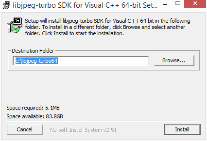

Use the libjpeg-turbo library 
===============================

The libjpeg-turbo library creates jpeg in a more efficient way that the default libjpeg library. To use it in GeoServer, two things must be installed: the library itself and the ``libjpeg-turbo Map Encoder extension``.

Installing the libjpeg-turbo library
-------------------------------------

To install the library in a Windows machine, follow these steps:

1. Download the library installer for the `libjpeg-turbo download page <https://sourceforge.net/projects/libjpeg-turbo/files/2.0.4/libjpeg-turbo-2.0.4-vc64.exe/download>`_

2. Execute the installer and follow the installation instructions.

Installing the Map Encoder extension
-------------------------------------

1. Download the extension for the Geoserver version contained in Geoserver Enterprise from `this download link <https://sourceforge.net/projects/geoserver/files/GeoServer/2.16.2/extensions/geoserver-2.16.2-libjpeg-turbo-plugin.zip/download>`_ 

2. Unzip the downloaded zip file in the ``WEB-INF/lib`` directory of the GeoServer installation.

3. Restart you GeoServer instance for the changes to take effect.

