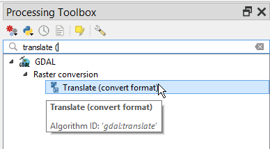
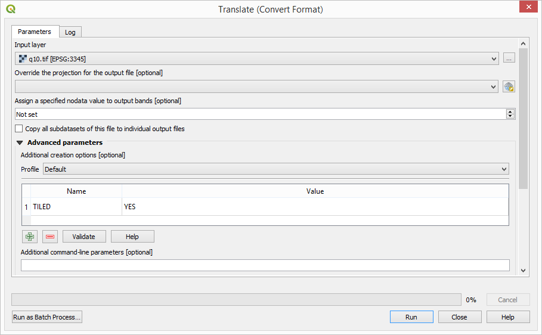
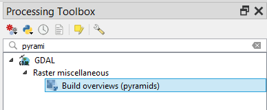
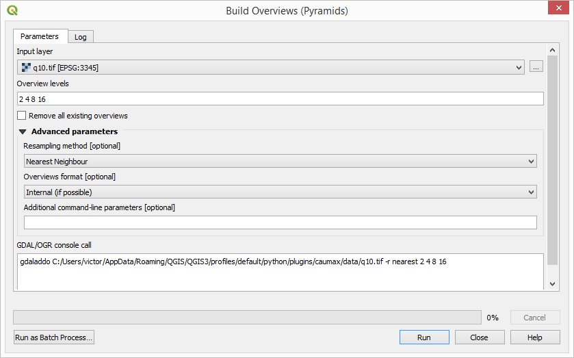

Ensure GeoTIFF layers have internal tiling and overview defined
================================================================

In order to have efficient access to raster data in large raster layers, and to have a good performance when rendering them, raster files must have
internal tiling and overviews defined.

Before publishing your raster layers to Geoserver, make sure that the have both internal tiles and overviews. Not all format supports this capabilities, but the GeoTiff format does. and it's the recommended one to use, specially for large layers.

Creating a GeoTiff file with internal tiles
---------------------------------------------

A new Tiff file with internal tiles can be created using the GDAL command tool ``gdal_translate`` and the ``TILED=YES`` creation option. For a layer named ``myTiff.tiff`` without internal tiles, a new one with internal tiles named ``myTiledTiff.tiff`` can be created using the following command::

	gdal_translate -of GTiff -co "TILED=YES" myTiff.tiff myTiledTiff.tiff

If you do not have GDAL installed in your syste, or you prefer to use a UI instead of a console, you can created a tiled Tiff using QGIS.

1. Open your layer in QGIS.

2. In the :guilabel:`Processing Toolbox`, find the :guilabel:`GDAL/Translate (convert format)` algorithm. Double click on it.

3. Select the layer to process in the :guilabel:` Input layer` field, add an option named ``TILED`` with a value equal to ``YES`` in the :guilabel:`Additional creation options` field, and enter the path for the output file to create in the :guilabel:`Converted` field.

4. Click on :guilabel:`Run` and the new layer will be created.

Adding overviews to a GeoTiff file
----------------------------------

Overviews can be added using the GDAL ``gdaladdo`` utility. for a layer named ``myTiff.tiff`` without overviews, these can be added with the following command::

	gdaladdo -r average myTiff.tif 2 4 8 16

It adds overviews that are downsampled 2, 4, 8 and 16 times compared to the original.

Overviews can also be created using QGIS.

1. Open your layer in QGIS.

2. In the :guilabel:`Processing Toolbox`, find the :guilabel:`Build overviews (pyramids)` algorithm. Double click on it.

3. Select your layer in the :guilabel:` Input layer` field and type :kbd:`2 4 8 16` in the :guilabel:`Overview levels` field

