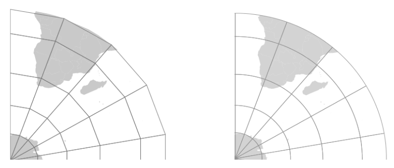

Welcome
=======

Welcome to GeoServer Enterprise, and thank you for being a GeoCat customer.

GeoServer is a class-leading application for the publishing of spatial information using international and industry standards. GeoServer provides direct access to feature and raster content, rich cartographic visualization, and geospatial processing. GeoServer integrates smoothly into your existing GIS infrastructure working with database, file, and cloud storage.

GeoCat is a proud open source company, and a core-contributor of GeoServer project. This GeoServer Enterprise release is built using the latest GeoServer, GeoWebCache, GeoTools, JAT-EXT, and JTS Topology Suite technologies. 

.. contents:: What is New
   :depth: 3
   :local:

2020.5 release:

.. toctree::
   :maxdepth: 1

   release_notes_218

Prior releases:

.. toctree::
   :hidden:
   :maxdepth: 1

   release_notes_217
   release_notes_216

* :doc:`release_notes_217`
* :doc:`release_notes_216`

`Contact GeoCat BV <http://geocat.net/contact/>`__ for more information on this product and the advantages of commercial open source.

.. footer:: This document includes `creative commons attribution license <http://creativecommons.org/licenses/by/3.0/>`__ content from the `GeoServer User Manual <https://docs.geoserver.org>`__ , and :website:`GeoServer <blog>` and `GeoTools <http://geotoolsnews.blogspot.com>`__ release announcements. Material has been adapted to reflect the GeoServer Enterprise product and visual appearance.

WMS Improvements
----------------

Faster map rendering of complex styles
''''''''''''''''''''''''''''''''''''''

When working with complex styles, with lots of rules and complex filtering conditions, GeoServer can now locate the right symbolizer much quicker than previous versions. This is useful, for example, in the GeoServer home page demo map, rendered from OSM data using a OSM Bright clone built with the CSS module.

Dynamic densification on reprojection
'''''''''''''''''''''''''''''''''''''

GeoServer has always reprojected data “point by point”, this typically caused long lines represented by just two points to be turn into straight lines, instead of curves, as they were supposed to.

There is a new “advanced projection handling” option in WMS enabling on the fly densification of data, the rendering engine computes how much deformation the projection applies in the area being rendered, and densifies the long lines before reprojection, resulting in eye pleasing curves in output. See a “before and after” comparison.

   
   Reprojection, original point by point versus densified mode

EPSG database updated to v 9.6
''''''''''''''''''''''''''''''

The EPSG database has been updated to version 9.6, including roughly a thousand more codes than the previous version available in GeoServer. The code has also been updated to ensure the NTv2 grid shift files between GDA94 and GDA2020 work properly.

Sponsored by GeoScience Australia.

SLD Service
'''''''''''

The optional :user:`SLD Service <extensions/sldservice/index.html>` extension is available for:

* The generation of classified maps of vector data based on criteria such as equal interval, quantiles and unique values.
* Vector data filtering based on standard deviation, equal area classification
* Raster processing with the generation of classified maps and data filtering.
* Raster processing makes use of automatic sub-sampling when the source image is too large.

WFS Improvements
----------------

Complex GeoJSON output changes
''''''''''''''''''''''''''''''

To improve GeoServer WFS generation of GeoJSON out of complex features data sources (app-schema), the following improvements have been made:

* The property/element alternation typical of GML is preserved, causing deeply nested data structures.
  
  To avoid writing `container.x.x` access to reach the `x` value, the output now skips one of the containers and exposes a direct `container.x` structure.
  
* XML attributes are now turned into plain JSON properties, and prefixed with a `@`
* Feature and data types are now preserved in translations, as a `@feaureType` and `@dataType` attributes
* Full nested features are encoded as GeoJSON again, keeping their identifiers

Sponsored by French geological survey – BRGM, and the French environmental information systems research center – INSIDE.

WMTS Improvements
-----------------

Tile protocols are provided by an emended GeoWebCache component.

Azure GeoWebCache blobstore
'''''''''''''''''''''''''''

Tiles can now be stored in Azure blob containers, increasing GeoWebCache compatibility with cloud environments.

Note Azure does not provide, a mass blob delete API. On truncate GeoWebCache is required to individually remove tiles making a DELETE request for each one.

GeoServer Administration
------------------------

The :user:`Status Monitoring  <configuration/status.html#system-status>` tab is now included in the GeoServer :guilabel:`Status` page. This provides system statistics so monitor resource use from the Web UI.

GeoServer Security
------------------

Authentication key extension
''''''''''''''''''''''''''''

The :user:`Authkey <extensions/authkey/index.html>` extension is now available, allowing security unaware applications to access GeoServer. In order to keep the system secure the keys should be managed as temporary session tokens by an external application.

Data stores
-----------

PostGIS Improvements
''''''''''''''''''''

The PostGIS data store sees a few improvements, including:

* TWKB encoding for geometries for all WMS/WMTS requests, reducing the amount of data travelling from the database to GeoServer
* The JDBC driver used to transfer all data as ASCII, the code was modified to allow full binary transfer when prepared statements are enabled (driver limitation, binary can only be enabled in that case)
* SSL encryption control, the driver defaults to have it on with a significant overhead, if the communication is in a trusted network the encryption can be disabled with benefit to performance
* Improved encoding of `OR` filters, which now use the `IN` operator where possible, increasing the likeliness that an eventual index on that column will be used
* Native KNN nearest search when using the `nearest` filter function

OGC/GDAL stores updated to GDAL 2.x
'''''''''''''''''''''''''''''''''''

The OGR datastore as well as the GDAL image readers have been updated and now work against GDAL 2.x official binaries, without requiring custom builds.

* The OGR datastore can open any vector data source
* Provides access to the native FileGBD library when using Windows
* Can be used to open Spatialite files

Spatialite Store removed
''''''''''''''''''''''''

Direct native access to Spatialite files is no longer available, we recommend:

* Use of OGR Store to read Spatilite files
* Migrate to the use of OGC standard geopackage, which makes use of an SQLite database using an industry defined standard.

