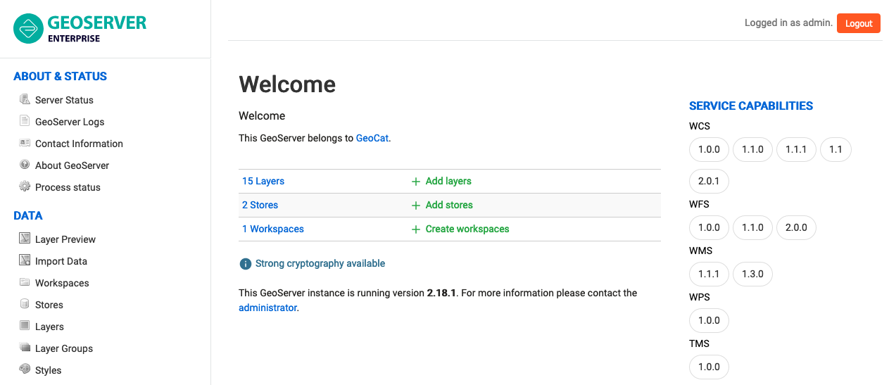
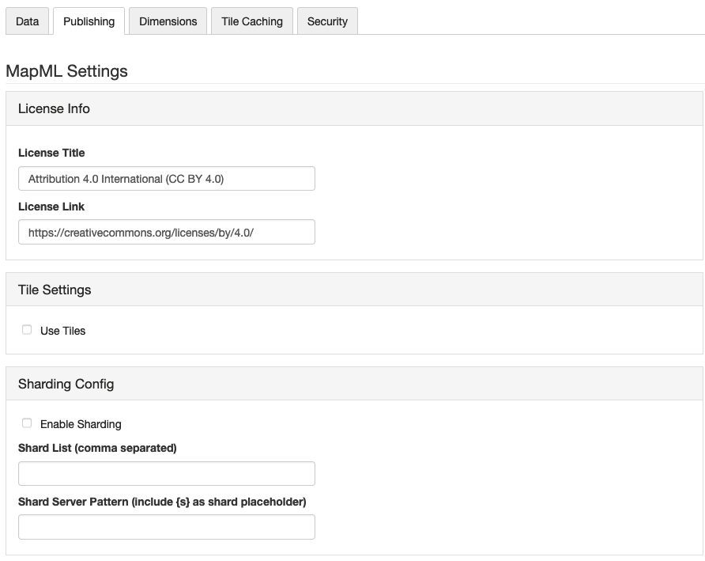

Welcome
=======

Welcome to GeoServer Enterprise, and thank you for being a GeoCat customer.

GeoServer is a class-leading application for the publishing of spatial information using international and industry standards. GeoServer provides direct access to feature and raster content, rich cartographic visualization, and geospatial processing. GeoServer integrates smoothly into your existing GIS infrastructure working with database, file, and cloud storage.

GeoCat is a proud open source company, and a core-contributor of GeoServer project. This GeoServer Enterprise release includes the latest GeoServer, GeoWebCache, GeoTools, JAT-EXT, and JTS Topology Suite technologies. 

Current release:

.. toctree::
   :maxdepth: 1

   release_notes_2021.3
   
Prior releases:

.. toctree::
   :maxdepth: 1

   release_notes_2021.2
   release_notes_2021.1

`Contact GeoCat BV <http://geocat.net/contact/>`_ for more information on this product and the advantages of commercial open source.

.. note:: This document includes `creative commons attribution license <http://creativecommons.org/licenses/by/3.0/>`_ content from the `GeoServer User Manual <https://docs.geoserver.org>`_ , and :website:`GeoServer <blog>` and `GeoTools <http://geotoolsnews.blogspot.com>`_ release announcements. Material has been adapted to reflect the GeoServer Enterprise product and visual appearance.

GeoServer Enterprise Theme
--------------------------

GeoServer Enterprise continues to improve with new page icons.

   
   GeoServer Enterprise Theme

Services
--------

Internationalization
''''''''''''''''''''

Data stores
-----------

ArcSDE Store removed
''''''''''''''''''''

The ArcSDE extension is no longer available as ArcSDE 10.2.2 has been `retired <https://support.esri.com/en/Products/legacy-products/legacy-products/ArcSDE/10-2-2>`__.

We recommend:

* Use of cascaded WMS and WFS services
* Contact support for additional options.

Mapping
-------

Internationalization
''''''''''''''''''''

Map labels generation can now be internationalized with the addition of a ``langage`` function. Support has also been added to support the internationalized of rules (as seen in legend generation).

Reference:

* :ref:`internationalization`
* :ref:`sld_language`

Control legend generation with mapOnly and legendOnly
'''''''''''''''''''''''''''''''''''''''''''''''''''''

You can now choose which rules are used for legend generation using the mapOnly and legendOnly vendor options (to mark how rules are used).

Reference:

* :ref:`rendering_selection`

MapML extension
'''''''''''''''

The MaoML extension tracks the emergency W3C standard to define an html element for web mapping. The extension provide additional publishing options and includes a LayerPreview.

   
   Layer Publishing MapML settings

MapML can support a dimension, for layers with a time or elevation attribute. MapML supports tiling, when using the one of the included GridSets for WGS84, OSMTILE.

Reference

* :user:`MapML Extension <extensions/mapml/index.html>`.
